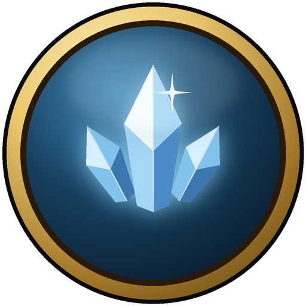

# LonelyIce

Your own World of Warcraft 3.3.5a (Wrath of the Lich King) world, for playing alone or with a few friends,
in one application. LonelyIce sets everything up from the game client you already have, runs the server in
the background and starts the game with one button.

## Getting started

1. Download a release and unpack it anywhere, for example next to your game folder.
2. Run `LonelyIce.exe`. The setup wizard finds your game, prepares the server data from it and creates your
   account. The first setup takes from twenty minutes to an hour, depending on your computer.
3. Press **Play**.

You need a World of Warcraft 3.3.5a client (build 12340). LonelyIce does not include or download any game
data.

## What you get

- **One button to play**: LonelyIce starts the server, points the game at it and launches the game.
- **A world that feels alive**: server features come as plugins, which you can add, remove and configure.
- **Settings without config files**: experience and drop rates, difficulty, world options and plugin settings
  in plain words, with a note on whether a change needs a restart.
- **Game master tools**: common server commands as simple forms, account management, and a console for the
  rest.
- **Runs quietly in the tray**: closing the window keeps your world running; start, stop and restart from the
  tray menu.
- **Automatic backups** of your characters and your world, as often as every hour: only what changed takes
  space, old backups thin out by themselves within the disk space you allow, and any of them can be restored
  with two clicks.

## Building from source

See [docs/building.md](docs/building.md). Plugin authors: [docs/plugin-format.md](docs/plugin-format.md).

## Support

LonelyIce is free, with no ads and no paid features. If it is useful to you, you can
[buy me a coffee](https://buymeacoffee.com/darthgelum): it pays for the server, code signing and development time.

## License

GNU General Public License v2.0 or later, see [LICENSE](LICENSE). World of Warcraft is a trademark of Blizzard
Entertainment; LonelyIce contains no game data and works only with a client you own.
